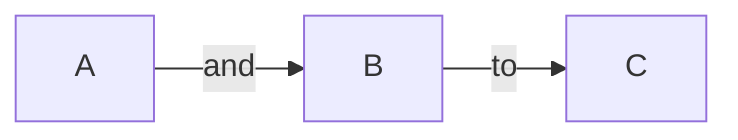

# Github Tutorial

## Basis Formatting Syntax

### Headings Example

# A first-level heading
## A second-level heading
### A third-level heading
#### A four-level heading
##### A five-level heading
###### A six-level heading

### Paragraphs Example

Lorem ipsum dolor sit amet, consectetur adipiscing elit. Etiam est odio, commodo id diam sed, pulvinar sagittis tortor. Nam vestibulum purus eros. Sed congue, mi id pretium auctor, nibh augue iaculis arcu, eu tristique quam dolor at erat.

Quisque vel odio condimentum, mollis sem vitae, porta diam. Praesent ligula elit, condimentum eget ex sed, commodo sollicitudin sapien.


Proin volutpat faucibus nulla. Nullam eros sem, ultricies gravida nunc nec, dapibus posuere nisl. Nunc lacinia elementum turpis in pharetra. Aenean eu neque eros.


### Comment Example

<!-- This content will not appear in the rendered Markdown -->

### Styling text Example 

#### Bold

**your text**

#### italics

*your text*
_your text_

#### strikethrough

~~your text~~

#### subscript

The subscript <sub> text </sub> is here.


#### superscript

The subscript <sup> text </sup> is here.


### Quote Example

> Text that is a quote


### Code Example


#### Code Block

```
// ES5 syntax
var multiply = function(x, y) {
  return x * y;
};

// ES6 arrow function
var multiply = (x, y) => { return x * y; };

// Or even simpler
var multiply = (x, y) => x * y;   
```

#### Inline code Block

## Inline code Block

JavaScript provides three different value comparison operations: strict equality using `===`, loose equality using `==`, and the `Object.is()` method.

#### Code Highlighting Example

```javascript
console.log('Hello World');
```

### Links Example

#### Inline links

This site was built using [GitHub Pages](https://pages.github.com/).

#### Relative links

[Contribution guidelines](docs/CONTRIBUTING.md)

[Contribution guidelines](../docs/CONTRIBUTING.md)


### Image Example


### Lists Example

#### Ordered list

1. one
2. two
3. three
4. four

#### Unordered list

* First item
* Second item
* Third item
* Fourth item


- First item
- Second item
- Third item
- Fourth item

+ First item
+ Second item
+ Third item
+ Fourth item

#### Task list

- [x] #739
- [ ] https://github.com/octo-org/octo-repo/issues/740
- [ ] Add delight to the experience when all tasks are complete :tada:

### Mentioning people and teams Example

### Person or Individual Username

@officialrajdeepsingh, check out the following change.

### Team or Company Example

The section blog theme is maintained by @frontendweb

### Referencing issues and pull requests Example

Remove the default _target blank in logo #93

### Using Emojis Example

Don't forget to leave a star on our repository! :star:

### Footnotes Example

Here's a simple footnote,[^1] and here's a longer one.[^bignote]

[^1]: This is the first footnote.

[^bignote]: Here's one with multiple paragraphs and code.

### Alerts Example

> [!NOTE]
> Useful information that users should know, even when skimming content.

> [!TIP]
> Helpful advice for doing things better or more easily.

> [!IMPORTANT]
> Key information users need to know to achieve their goal.

> [!WARNING]
> Urgent info that needs immediate user attention to avoid problems.

> [!CAUTION]
> Advises about risks or negative outcomes of certain actions.


## Advanced Formatting Syntax

### Table Example


| First Header  | Second Header |
| ------------- | ------------- |
| Content Cell  | Content Cell  |
| Content Cell  | Content Cell  |

### Collapsed Section Example

<details>
  <summary>Click to here. </summary>
   
   ### You can add a message here

   You can add text within a collapsed section. 

   You can add an image or a code block, too.

   ```ruby
     puts "Hello World"
   ```
  
</details>


### Diagrams Example


#### Mermaid Example




#### GeoJSON and TopoJSON Example

##### GeoJSON

```geojson
{
  "type": "FeatureCollection",
  "features": [
    {
      "type": "Feature",
      "id": 1,
      "properties": {
        "ID": 0
      },
      "geometry": {
        "type": "Polygon",
        "coordinates": [
          [
              [-90,35],
              [-90,30],
              [-85,30],
              [-85,35],
              [-90,35]
          ]
        ]
      }
    }
  ]
}
```
##### TopoJSON
```topojson
{
  "type": "Topology",
  "transform": {
    "scale": [0.0005000500050005, 0.00010001000100010001],
    "translate": [100, 0]
  },
  "objects": {
    "example": {
      "type": "GeometryCollection",
      "geometries": [
        {
          "type": "Point",
          "properties": {"prop0": "value0"},
          "coordinates": [4000, 5000]
        },
        {
          "type": "LineString",
          "properties": {"prop0": "value0", "prop1": 0},
          "arcs": [0]
        },
        {
          "type": "Polygon",
          "properties": {"prop0": "value0",
            "prop1": {"this": "that"}
          },
          "arcs": [[1]]
        }
      ]
    }
  },
  "arcs": [[[4000, 0], [1999, 9999], [2000, -9999], [2000, 9999]],[[0, 0], [0, 9999], [2000, 0], [0, -9999], [-2000, 0]]]
}
```

#### ASCII STL Example

```stl
solid cube_corner
  facet normal 0.0 -1.0 0.0
    outer loop
      vertex 0.0 0.0 0.0
      vertex 1.0 0.0 0.0
      vertex 0.0 0.0 1.0
    endloop
  endfacet
  facet normal 0.0 0.0 -1.0
    outer loop
      vertex 0.0 0.0 0.0
      vertex 0.0 1.0 0.0
      vertex 1.0 0.0 0.0
    endloop
  endfacet
  facet normal -1.0 0.0 0.0
    outer loop
      vertex 0.0 0.0 0.0
      vertex 0.0 0.0 1.0
      vertex 0.0 1.0 0.0
    endloop
  endfacet
  facet normal 0.577 0.577 0.577
    outer loop
      vertex 1.0 0.0 0.0
      vertex 0.0 1.0 0.0
      vertex 0.0 0.0 1.0
    endloop
  endfacet
endsolid
```

### Mathematical Expressions Example

#### Writing inline math expressions

The inline math expression example: $\sqrt{3x-1}+(1+x)^2$

#### Writing math expressions as code blocks

```math
\left( \sum_{k=1}^n a_k b_k \right)^2 \leq \left( \sum_{k=1}^n a_k^2 \right) \left( \sum_{k=1}^n b_k^2 \right)
```


